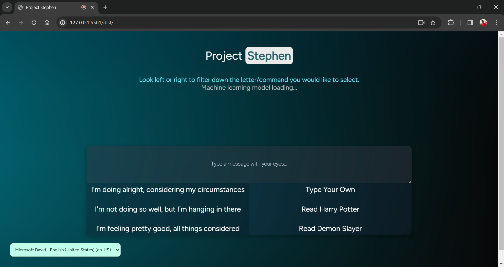
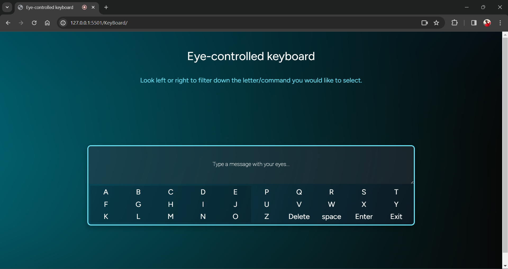

# Project Stephen

Project Stephen is an innovative communication tool designed to empower individuals with disabilities, particularly those who are unable to use traditional methods of communication such as speech or manual typing. Named after the renowned physicist Stephen Hawking, who himself relied on advanced communication technology due to his ALS (amyotrophic lateral sclerosis) condition, this project aims to provide a means for people with disabilities to express themselves effectively and interact with the world around them.

## Screenshots

_Main Speech Recognition Page_

_Calibration Page_

_Iris Keyboard Page_

## Overview

The core functionality of Project Stephen revolves around utilizing eye movement technology to enable communication. By tracking the user's eye movements, the system allows them to select words or phrases from a screen, which are then converted into text using a speech synthesizer. This enables individuals with severe physical limitations to communicate with others, access information, and participate more fully in various aspects of life.

### Features

- **Eye Movement Tracking**: Users can control the interface by moving their eyes, and selecting words or phrases displayed on the screen.
- **Speech Synthesis**: Selected words are converted into spoken language using a voice synthesizer, enabling verbal communication.
- **Text-to-Text Conversion**: Converts spoken words into text, making communication accessible for individuals with hearing impairments.
- **Automatic Response Suggestions**: Provides relevant response suggestions based on the conversation context, reducing the need for manual typing.
- **Future Goals**: Planned enhancements include expanding functionality to allow for actions like opening tabs and using a cursor, as well as facilitating coding tasks.

## Usage

To use Project Stephen, users simply need to access the interface through a compatible device with eye-tracking capabilities. The system guides users through the process of selecting words and phrases, with options for both automatic response suggestions and manual typing using eye movements.

## Technologies Used

Project Stephen is built using the following technologies:

- TensorFlow.js: Utilized for eye movement tracking and machine learning functionalities.
- Node.js: Powers the backend server for handling requests and processing data.
- Express.js: Provides a robust framework for building web applications and APIs.
- HTML/CSS: Frontend components and styling for the user interface.

## Contribution Guidelines

We welcome contributions from the community to help improve and expand Project Stephen. If you're interested in contributing, please follow these guidelines:

- Fork the repository and create a new branch for your changes.
- Ensure all changes are properly tested and documented.
- Submit a pull request detailing the changes made and any relevant information.
